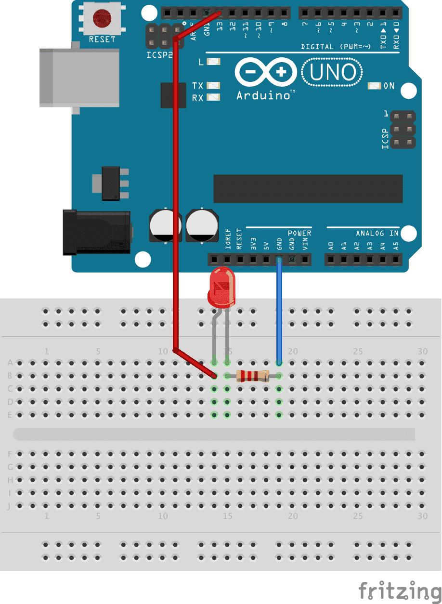
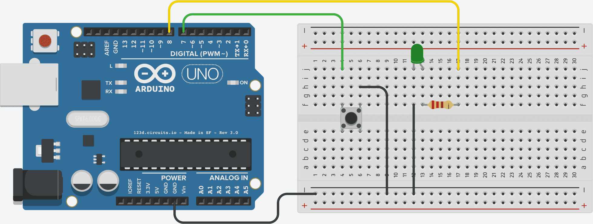

# Introduksjon {.intro}

__Arduino__ er en mikrokontroller som kan programmeres til å styre elektroniske
dingser og duppeditter. Ved hjelp av en Arduino kan du skru av og på
lyset på rommet ditt når noen åpner døren, sende melding til
datamaskinen din hvis det blir kaldt eller vanne plantene
dine automatisk når du er borte. Det er kun fantasien som setter
grenser for hva en Arduino kan gjøre!

Her skal vi programmere Arduinoen til å få et lys til å blinke. For å gjøre
denne oppgaven trenger du en Arduino, som er vist på bildet.

<figure></figure>

# Steg 1: Installere programvaren {.activity}

Det første vi må gjøre er å installere programvaren som lar oss programmere
Arduinoen. Vent med å koble til Arduinoen til etter du er ferdig med installasjonen.

## Sjekkliste {.check}

+ Last ned Arduino-programvaren fra [Arduno.cc](https://www.arduino.cc/en/Main/Software).
+ Installer programmet. Er du usikker på hvordan man gjør dette, bør du snakke med en veileder.
+ Åpne programmet. Ikonet ser ut som dette:

  

+ Koble Arduinoen til datamasinen.


# Steg 2: Studere Arduino-brettet {.activity}

*La oss bli kjent med Arduino-brettet.*
Under ser du Arduino-brettet. Finn frem din Arduino og studer den!

<figure></figure>


## Sjekkliste {.check}

+ På den ene siden har vi digitale inn- og utganger merket med **DIGITAL (PWM ~ )**.
+ Fra nå av kaller vi inn/utganger for *port*.
+ Den første digitale porten heter **0**.
+ Den siste digitale porten heter **13**.
+ Det er altså totalt 14 digitale porter.
+ Portene som har **~** ved siden av seg har funksjonaliteten *PWM* (Pulse Width Modulation).
+ På den andre siden har vi analoge innganger, merket **ANALOG IN**.
+ Første analoge inngang heter **A0**.
+ Den siste analoge inngangen heter **A5**.
+ Det er altså 6 analoge innganger.
+ **5V** er 5 Volt.
+ **GND** er jord, altså 0 Volt eller minus som noen kaller det.
+ Hva tror du **3.3V** er?

# Steg 3: Lag en krets {.activity}

*Nå skal vi lage vår første krets på en Arduino.*

## Sjekkliste {.check}

+ Finn en lysdiode og noen ledninger.
+ Finn en 270 Ohm motstand.
+ Koble slik som vist i figuren:

  

+ Ingenting skjer, vi må skrive kode!

### Om koblingen {.protip}

Nå har vi koblet vår første __krets__. Hvis du studerer koblingen, vil du se
at det er en lukket krets. Det vil si at strømmen går fra pluss til minus
gjennom kretsen:

- Fra digital 13 (pluss).
- Gjennom lysdioden.
- Gjennom motstanden.
- Til GND (minus).

Port 13 som er tilkoblet den røde ledningen er en digital port. Denne porten
kan vi programmere slik at lysdioden blinker. Dette er akkurat som en
__lysbryter__.

Den fargerike klumpen er en motstand. Denne begrenser strømmen,
slik at vi ikke ødelegger lysdioden.

# Steg 4: Få lysdioden til å blinke {.activity}

*Nå er det på tide at vi koder litt!*
Det første programmet skal blinke med lysdioden.

## Sjekkliste {.check}

+ Åpne Arduino-programmet om det ikke allerede er åpent.
+ Arduino-programmet starter med denne koden:

  ```cpp
  void setup(){

  }

  void loop(){

  }
  ```

+ Skriv denne koden:

  ```cpp
  int led = 13;

  void setup(){
    pinMode(led, OUTPUT);
  }

  void loop(){
    digitalWrite(led, HIGH);
    delay(1000);
    digitalWrite(led, LOW);
    delay(1000);
  }
  ```

+ Trykk på play-knappen for å laste opp koden.
+ Blinker lysdioden?

### Utfordringer {.challenge}

+ Klarer du å få lysdioden til å blinke raskt, med en lang pause mellom blinkene?
+ Klarer du å lage ditt eget blinkemønster?
+ Klarer du å endre utgangen til port 11? Hvilken ledning må du flytte?

### Hva er `void setup()` og `void loop()`? {.protip}

Lurer du på hva `void setup()` og `void loop()` er?

`void setup()` er kode som kjøres en gang når Arduinoen slås på. Der skriver du
oppstartskode, slik som å bestemme om en port skal være inngang eller utgang.

`void loop()` er kode som kjøres på nytt og på nytt, altså repeteres evig. Lurte
du på hvorfor lampen blinket mer enn én gang? Det fordi Ardiuno-brettet starter på
toppen i `void loop()` rett etter den er ferdig med slutten på `void loop()`.


### Hva er `led`? {.protip}

Noe av det første som står i koden er:

```cpp
int led = 13;
```

LED står for Light Emitting Diode, eller lysdiode på norsk. Linjen lagrer tallet 13
til *variabelen* `led`, som er heltall (**int**eger på engelsk). Da kan vi senere
bruke `led` i `pinMode`:

```cpp
pinMode(led, OUTPUT);
```

Og i `digitalWrite`:

```cpp
digitalWrite(led, HIGH);
```

Dette er fint hvis vi senere ønsker å bytte utgang. Da trenger vi bare å endre
en linje, istedenfor alle linjene vi nå bruker `led`.

Husk at du alltid må bruke __;__ på slutten av hver kode linje!

# Steg 5: Legg til en knapp {.activity}

*Nå skal vi skru av og på lampen med en knapp!*
Vi har nå lært hvordan vi kan få en lampe til å blinke. Neste steg er derfor å skru
lampen av og på med en knapp!

## Sjekkliste {.check}

+ Finn en ledning og en knapp.
+ Koble til bryteren som på bildet under:

  

+ Skriv denne koden:

  ```cpp
  int led = 13;
  int knapp = 7;

  void setup(){
    pinMode(led, OUTPUT);
    pinMode(knapp, INPUT_PULLUP);
  }

  void loop(){
    if(digitalRead(knapp) == LOW){
      digitalWrite(led, HIGH);
    } else {
      digitalWrite(led, LOW);
    }
  }
  ```

+ Trykk på play-knappen for å laste opp koden.
+ Lyser lysdioden når du trykker på knappen?

Se der! Nå har du lært å lage enkle kretser med Arduino!

### Utfordringer {.challenge}
Her er noen nøtter du kan prøve deg på ved å endre koden.

+ Kan du få lysdioden til å blinke når knappen trykkes inn?
+ Kan du få lysdioden til å lyse svakt med `analogWrite(led, 50);`?

  Hva skjer om `50` endres til ett større tall?

  **Merk:** Lysdioden må være tilkoblet en port som har *PWM* for at
  `analogWrite` skal fungere.

+ Kan du få lysdioden til å skrus på av et kort trykk på knappen?
  Og deretter skru av lysdioden med et nytt kort trykk?
