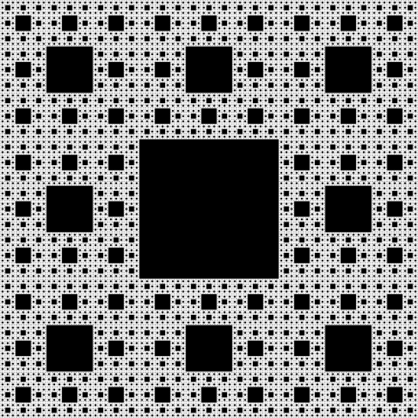

# Introduksjon {.intro}

En fraktal er en geometri med et mønster som gjentar seg selv inne i seg selv.
Høres ikke det rart ut? I denne oppgaven skal vi lage våre egne.

Her er Sierpinski-teppet, som er en fraktal:



# Steg 1: Hvordan fungerer Sierpinski? {.activity}

Fraktaler følger tre regler:

- **Startregelen** gir hvor vi skal starte. Med en firkant? En trekant? En
  strek?
- **Tegneregelen** gir hvordan vi skal tegne på nivået vi er. Fargelegge en bit
  av firkanten? Splitte en strek i to?
- **Rekursjonsregelen** deler opp figuren vår i mindre biter, som vi kjører på
  nytt i. Lager firkanten vi tegnet nye firkanter? Lager streken vi tegnet nye
  streker? Gjenta for hver strek.

## Sjekkliste {.check}

Gå til [Wikipedia-artikkelen](https://en.wikipedia.org/wiki/Sierpinski_carpet)
til Sierpinski-teppet. Se på animasjonen.

- Hvordan er teppet før det begynner å bli fargelagt? Dette er **startregelen**.
- Hva tegner vi i hver firkant? Dette er **tegneregelen**.
- Hvordan gjentas regelen? Dette er **rekursjonsregelen**.

Se på figurene under avsnittet **Process**. Ser du at noe gjentar seg?

# Steg 2: Tegne kvadrater med SVG {.activity}

Nå skal vi begynne å tegne kvadratene teppet:

<svg width="500" height="500" viewBox="0 0 27 27"><rect x="0" y="0" width="27" height="27" fill="blue"></rect><rect x="9" y="9" width="9" height="9" fill="green"></rect><rect x="3" y="3" width="3" height="3" fill="green"></rect><rect x="12" y="3" width="3" height="3" fill="green"></rect><rect x="21" y="3" width="3" height="3" fill="green"></rect><rect x="3" y="12" width="3" height="3" fill="green"></rect><rect x="21" y="12" width="3" height="3" fill="green"></rect><rect x="3" y="21" width="3" height="3" fill="green"></rect><rect x="12" y="21" width="3" height="3" fill="green"></rect><rect x="21" y="21" width="3" height="3" fill="green"></rect></svg>

Ett kvadrat kan vi tegne slik:

```elm
import Svg exposing (svg, rect)
import Svg.Attributes exposing (width, height, viewBox, fill, x, y, width, height)


main =
    svg
      [ width "500", height "500", viewBox "0 0 27 27" ]
      [ rect [ x "0", y "0", width "27", height "27", fill "blue" ] [ ]
      , rect [ x "9", y "9", width "9", height "9", fill "green" ] [ ]
      ]
```

<svg width="500" height="500" viewBox="0 0 27 27"><rect x="0" y="0" width="27" height="27" fill="blue"></rect><rect x="9" y="9" width="9" height="9" fill="green"></rect></svg>

## Sjekkliste {.check}

- Hvordan kan vi da tegne mange kvadrater?
- Hva bestemmer posisjonen til tallene?
- Hvor mange store grønne kvadrater har du tegnet?
- Hvor mange små grønne kvadrater har du tegnet?
- **Utvid koden til å tegne mange kvadrater**.

# Steg 3: Datastrukturer {.activity}

Kan du telle hvor mange kvadrater det finnes i Sierpinski-teppet? Ikke jeg
heller. Hmm, gidder vi da å skrive de maaaange linjene SVG for hånd? Nei, vi
programmerer!

Vi skal nå representere kvadrater med Records i Elm. Records lar oss lage _våre
egne typer_. Vi kommer til å lage en type for punkter og en type for kvadrater.

## Sjekkliste {.check}

Nå skal du få prøve å lese Elm sine egne læreressurser.

- Gå til [Elm-dokumentasjonen for records](http://elm-lang.org/docs/records).
  Finner du eksempelet for et punkt?

Vi legger til en liten snutt i programmet vårt:

```elm
import Html exposing (div, text, h1)

import Svg exposing (svg, rect)
import Svg.Attributes exposing (width, height, viewBox, fill, x, y, width, height)

myPoint =
    { x = 9
    , y = 3
    }

main =
    div []
n      [ h1 [] [ text (toString myPoint) ]
      , svg
        [ width "500", height "500", viewBox "0 0 27 27" ]
        [ rect [ x "0", y "0", width "27", height "27", fill "blue" ] [ ]
        , rect [ x "3", y "3", width "3", height "3", fill "green" ] [ ]
        ]
      ]
```

Nå kan du endre `toString myPoint` for å skrive ut noe annet.

## Sjekkliste {.check}

- Skriv ut kun `x`-attributten til `myPoint`
- Lag et annet punkt, `yourPoint`. Velg koordinater og skriv ut dette i stedet.
- Lag et tredje punkt, `theirPoint`. Dette skal du lage _ut ifra `myPoint`_, men
  du skal bytte ut x-verdien med `0`. Se avsnittet **Updating Records** i guiden.

Nå skal vi ta steget videre og lage våre egne punkter.

**Husk!** Du kan bruke linjen `[ h1 [] [ text (toString yz) ]` til å teste
verdier.

- Les de to første eksemplene i avsnittet **Record types**.

Her finnes det allerede en `Point`-type vi kan bruke. Har du definert `myPoint`
og `yourPoint` på samme måte som det gjøres i guiden?

- Skriv inn `Point`-typen i programmet ditt
- Spesifiser at punktene dine skal være av typen `Point`:

  ```elm
  -- myPoint : Point betyr at myPoint skal være av type Point
  myPoint : Point
  myPoint = -- din tidligere løsning
  
  -- yourPoint : Point betyr at yourPoint skal være av type Point
  yourPoint : Point
  yourPoint = -- din tidligere løsning
  ```

Klager kompilatoren? Hvorfor/hvorfor ikke? Om den klager betyr det ikke at du
har gjort noe feil. Det bare at du og guiden lagde punkter på forskjellig måte.

- Utvid punktene dine med en z-verdi. Hva skjer når du kopilerer? Klarer du tyde
  feilmeldingen?
- Lag en ny type: `Point3D` som også har Z-verdi, og spesifiser at punktene dine
  skal være av denne typen:
  ```elm
  myPoint : Point3D
  -- ...
  ```

Dette får vi bruk for!

# Steg 4: Avanserte datastrukturer {.activity}

I steg 3 bygget vi opp datastruktren `Point` fra to tall av typen `Float`.

## Desimaltall {.protip}

Obs! Her kommer det matte. Viktig for oss nå:

Kommatall i Elm har typen `Float`.

Dette har en forklaring:

Desimaltall i Elm har typen `Float`. Float er kort for _Floating point number_,
som på norsk er _flyttall_. Disse kalles flyttall fordi de har _flytende
presisjon_. Det betyr at vi kan ha et fast antall _siffer_ med nøyaktighet. Vi
kan også lage veldig store tall, som 1000 * 1000 * 1000 * 1000 * 10000

