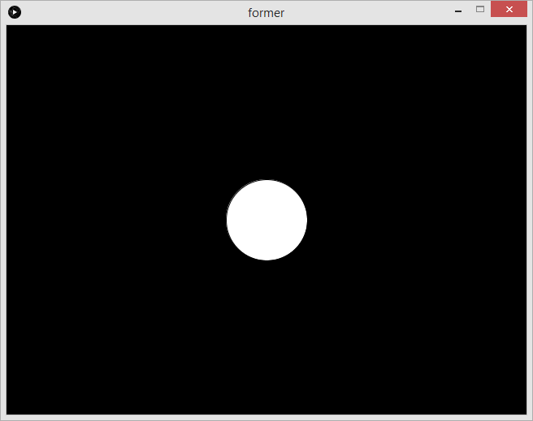
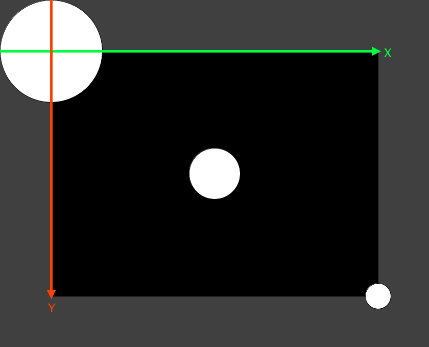
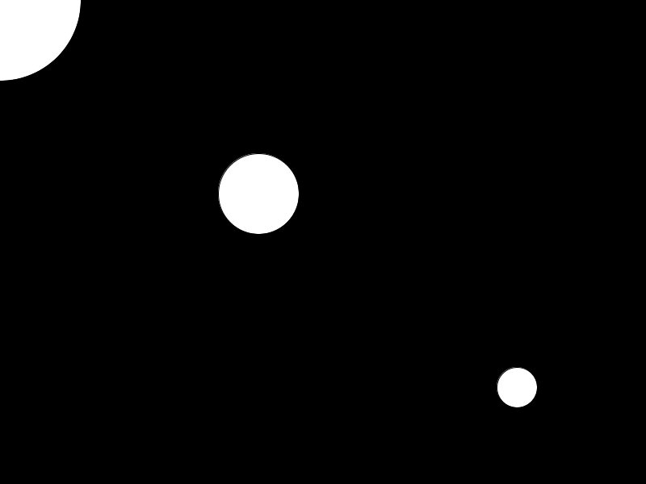

# Introduksjon: {.intro}

I denne modulen skal vi lære et programmeringsspråk og verktøy som
heter Processing. Det ble laget for å gjøre programmering lett for
designere og andre som ikke har programmert før, sånn at de kan lage
multimedieprogrammer, spill og liknende. Mange liker Processing fordi
det går fort å lage programmer som vanligvis krever mye arbeid.

# Steg 1: Vindu {.activity}

Nå skal vi begynne helt enkelt med å lage et vindu og fylle det med en
bakgrunnsfarge. Dette vil bli grunnlaget for nesten alle programmer
som du lager med Processing, så det er et fint sted å starte.

## Sjekkliste {.check}

+ Start Processing og skriv dette:

    ```processing
    void setup() {
      size(640, 480);
    }
    
    void draw() {
      background(0);
    }
    ```
+ Kjør programmet ved å trykke på **Ctrl+R**, knappen med en pil
  eller **Sketch --> Run** i menyen.
+ Lagre programmet som Former ved å trykke på **Ctrl+S** eller
  velg **File --> Save** i menyen.

### Hvordan skrive krøllparenteser og liknende {.protip}

TODO: Fikse bredden på celler i tabellen (det trengs marger for å få
litt horisontal luft). Sjekk at pipe skrives med Shift + 7 på Mac.

Her finner du en oversikt over hvordan man skriver en del tegn som
brukes i Processing og ofte i andre programmeringsspråk. Dette
beskriver hvordan det gjøres med vanlig norsk tastatur. Den dekker
også tegn som ikke blir brukt i denne øvelsen, så den kan være fin å
ta med seg videre.

| Tegn | Windows/Linux          | Mac                    |
|:----:| ---------------------- | ---------------------- |
| ;    | Shift + ,              | Shift + ,              |
| "    | Shift + 2              | Shift + 2              |
| \'   | \' (til høyre for Æ)   | \' (til venstre for 1) |
| \|   | \| (til venstre for 1) | Shift + 7              |
| \&   | Shift + 6              | Shift + 6              |
| \[   | Alt Gr + 8             | Alt + 8                |
| \]   | Alt Gr + 9             | Alt + 9                |
| {    | Alt Gr + 7             | Shift + Alt + 8        |
| }    | Alt Gr + 0             | Shift + Alt + 9        |

## Utforsking {.try}

Det anbefales at man utforsker mulighetene selv. Hva skjer hvis du:

+ Bytter ut det første tallet i `size(640, 480);`?
+ Bytter ut det andre tallet?
+ Hva om du bruker et annet tall i `background(0);`?
+ Hva skjer hvis tallet er høyere enn `255`?
+ Hva skjer hvis tallet er lavere enn `0`?
+ Før du går videre kan det være lurt å fjerne endringene som ble gjort i
  denne utforskingen.

## Forklaring av koden {.protip}

Selv om du har utforsket size og background litt, lurer du sikkert på
hva resten av koden gjør eller er godt for. Før vi går videre, skal vi
derfor ta en liten titt på hva all koden gjør.

`void setup() {` sier at vi skal ha en funksjon som heter setup, og
når denne blir kalt, vil all koden som kommer mellom krøllparentesene,
bli kjørt. Du lurer kanskje nå på hva en funksjon er og hva det vil si
å kalle en funksjon. En funksjon er en navngitt del med kode som kan
kjøres når man trenger det, ved å kalle den. `size(640, 480);` er et
eksempel på hvordan man kaller en funksjon. `size` er en funksjon som
er innebygd i Processing. Noen funksjoner gir en verdi som resultat
når de blir utført, men `setup` gjør ikke det. Siden den ikke har en
verdi som resultat, skriver vi `void` foran navnet. Parentesene etter
navnet har ikke noe innhold her, men her kan man bestemme hva slags
verdier som kan sendes til funksjonen når man kaller den. Hvis du ser
på kallet på `size` på linje to, ser du at denne får to tall
inn. `setup` er en spesiell funksjon som blir kjørt når programmet
starter. Krøllparentesen `}` på linje tre sier at funksjonen `setup`
er ferdig.

På linje 5 ser vi enda en funksjon som heter `draw`. Denne er også
spesiell, og blir kjørt om og om igjen så lenge programmet
kjører. Koden inne i denne: `background(0);` setter bakgrunnsfargen i
vinduet. Faktisk fylles hele vinduet med denne fargen. Tallet `0`
betyr at ikke noe lys skal lages, altså blir bakgrunnen svart. Hvit
har verdien `255`. Tallene imellom gir forskjellige gråtoner. Senere
skal vi se på hvordan vi kan gå fra svart-hvitt til farger.

# Steg 2: Sirkel {.activity}

Siden denne oppgaven skal handle om former, er det på tide at vi
kommer i gang med å tegne noen former. La oss begnne med å tegne en
sirkel midt i vinduet.

## Sjekkliste {.check}

+ Endre `draw` til følgende uten å endre `setup`:
    ```processing
    void draw() {
      background(0);
      ellipse(320, 240, 100, 100);
    }
    ```
+ Lagre med **Ctrl+S** og kjør programmet med **Ctrl+R**. Du skal
  da se en hvit sirkel midt i vinduet som i bildet under.



+ Legg til en sirkel til og kjør programmet igjen:
    ```processing
    void draw() {
      background(0);
      ellipse(320, 240, 100, 100);
      ellipse(0, 0, 200, 200);
    }
    ```

+ La oss legge til en siste sirkel og kjøre programmet enda en gang:
    ```processing
    void draw() {
      background(0);
      ellipse(320, 240, 100, 100);
      ellipse(0, 0, 200, 200);
      ellipse(640, 480, 50, 50);
    }
    ```


## Forklaring av koden {.protip}

Nå har du kanskje knekt koden for hvordan `ellipse` fungerer og hva de
forskjellige tallene gjør. Det første tallet bestemmer hvor langt til
høyre i vinduet sirkelen skal tegnes opp. Det andre tallet bestemmer
hvor langt ned i vinduet den skal tegnes opp. Det tredje tallet
bestemmer hvor bred sirkelen skal være. Det siste tallet bestemmer
hvor høy sirkelen er. Det siste hørtes kanskje rart ut, for en sirkel
er jo like bred som den er høy. Hvis de to siste tallene ikke er like,
får du nemlig ikke en sirkel, men en ellipse som er bredere enn den er
høy eller høyere enn den er bred. Og det er derfor funksjonen heter
`ellipse` og ikke `circle`.



I bildet ovenfor, vises også området utenfor bilderammen hvor resten
av de to siste sirklene tegnes opp. I tillegg viser to piler hvordan
de to første tallene i kallene på `ellipse` brukes. Det første tallet
angir posisjon langs X-aksen, vist med pilen merket X. Det andre
tallet angir posisjon lans Y-aksen, vist med pilen merket Y. Der disse
to pilene krysser hverandre har de verdien `0`, og de strekker seg til
kanten av vinduet med verdiene `640` for X og `480` for Y, som ble
bestemt av kallet på `size`. Man kan også tegne opp ting utenfor
bildet med negative tall eller tall som er større enn de brukt i
kallet på `size`.

# Steg 3: Variabler {.activity}

Til nå har vi brukt faste tall overalt. Dette fungerer ikke alltid så
bra. Hvis vi endrer størrelsen på vinduet, vil ikke sirkelen i midten
være i midten lenger og sirkelen i nederste høyre hjørne vil heller
ikke være riktig plassert. Hvis vi vil at sirklene skal bevege på seg,
kan vi heller ikke bruke faste verdier.

Dette løser vi ved hjelp av noe som heter variabler. En variabel kan
du tenke på som en navngitt verdi. Vi kan også endre på verdien som er
knyttet til navnet, og det er derfor det heter variabler: verdien kan
variere.

## Sjekkliste {.check}

+ For å løse det første problemet skal vi nå første endre størrelsen
  på vinduet i `setup`:

    ```processing
    void setup() {
      size(800, 600);
    }
    ```

  Legg merke til at sirkelen som var i midten og sirkelen i nederste
  høyre hjørnet, nå er litt til venstre og litt lenger opp
  enn midten og hjørnet:



+ Vi skal nå ta i bruk to variabler som heter `width` og `height`,
  altså bredde og høyde på engelsk. Disse får sin verdi når `size` kalles.
  Endre `draw` som følger:

    ```processing
    void draw() {
      background(0);
      ellipse(width / 2, height / 2, 100, 100);
      ellipse(0, 0, 200, 200);
      ellipse(width, height, 50, 50);
    }
    ```

  Her har vi også brukt et regnestykke for å tegne opp den første sirkelen.
  Skråstreken, `/`,  betyr delt på, så `width / 2` gir altså halvparten
  av bredden. `height / 2` gir jo da halvparten av høyden. Vi kunne også
  brukt `width * 0.5` for å oppnå det samme, men det blir da bredden ganget
  med en halv. Noen ganger er det enklere med deling og andre ganger ganging,
  men det kommer an på hvor vi vil plassere ting.

+ Lagre og kjør programmet, om du ikke har gjort det allerede.

+ Nå skal vi lage våre egne variabler. Dette kan vi bruke for å få formene
  til å bevege på seg:

    ```processing
    float x;
    float y;
    
    void setup() {
      size(800, 600);
      x = width / 2;
      y = height / 2;
    }
    ```

  De to linjene som ble lagt til før `setup`, sier at vi skal ha to variabler,
  `x` og `y`, og at disse er av typen `float`. `float` er en type som brukes
  til desimaltall. Inne i `setup` har vi gitt disse variablene verdier,
  som kommer fra det samme regnestykket som vi brukte i forrige punkt.

+ Det er ikke nok å bare ha variabler. Vi må bruke dem også, så vi
  endrer igjen på `draw`:

    ```processing
    void draw() {
      background(0);
      
      x = x + 1;
      
      ellipse(x, y, 100, 100);
      ellipse(0, 0, 200, 200);
      ellipse(width, height, 50, 50);
    }
    ```

  Den første sirkelen bruker nå variablene til posisjonen. I tillegg
  la vi til en ny linje som sier at `x` skal settes til én høyere enn
  den gamle verdien. Hva tror du vil skje nå som `x` blir større hver
  gang bildet tegnes opp?

+ Lagre og kjør programmet, om du ikke har gjort det allerede.

## Utforsking {.try}

Prøv å utforske hvordan du kan endre `x` og `y` for hver gang `draw` kjøres.

+ Kan du få sirkelen til å bevege seg mot venstre istedenfor høyre?
+ Klarer du å få den til å bevege seg opp eller ned istedenfor til en
  av sidene?
+ Hva med å å få den til å bevege seg på skrå?

# Steg 4: Sprette i veggen {.activity}

Det er litt kjedelig når sirkelen forsvinner ut av vinduet hele
tiden. Så nå skal vi lære å få sirkelen til å snu når den treffer
kanten av vinduet, som en ball som spretter tilbake hvis den kastes i
veggen.

# Steg 5: Andre former {.activity}

Denne leksjonen heter ikke /Sirkler/, men /Former/. Så da må vi nesten
lære hvordan vi kan tegne opp andre former enn sirkler. Derfor skal vi
nå se på hvordan man kan tegne firkanter og trekanter.
